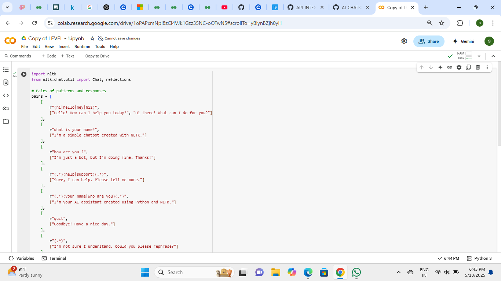

# AI-CHATBOT-WITH-NLP
*company*: CODTECH IT SOLUTIONS

*NAME*:  DOMALA ANJALI

*INTERN ID* : CT08DA202

*DOMAIN*: PYTHON

*DURATION*: 6 WEEKS

*MENTOR*: NEELA SANTHOSH
##BUILD A CHATBOT USING NATURAL LANGUAGE PROCESSING LIBRARIES LIKE NLTK OR SPACY, CAPABLE OF ANSWERING USER QUERIES.
##Objective:
To build a rule-based chatbot capable of responding to basic user queries.

To demonstrate the use of Natural Language Processing (NLP) using Python's NLTK library.

To simulate human-like interactions using predefined input-output pairs.
##Tools & Technologies Used:
Python: Programming language used to develop the chatbot.

NLTK (Natural Language Toolkit): Used for building the rule-based conversational model.

Regular Expressions (re module): For matching user input patterns.

Command Line/Terminal: Interface for user-chatbot interaction.

##Conclusion:
This project successfully demonstrates how to build a simple chatbot using NLTK that can handle basic greetings and queries. Although it's limited to predefined patterns, it forms the foundation for developing more intelligent NLP-based conversational agents.
##OUTPUT :

